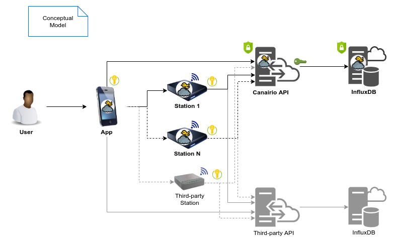

# canairio-services

CanAirIO Services `Project Description Here`

---

**Conceptual Model**:

---

> Work in progress ...

**TODO:**

- [ ] Add Project Description
- [ ] Add About the Project
- [ ] Add Introduction
- [x] Getting Started Tutorial
- [x] Postman API Documentation
- [ ] Add Code of Conduct
- [ ] Add Contributing Guidelines
- [ ] Add Issue Templates
- [ ] Add Pull request template

---

## About the Project

`About the Project Here`

## Introduction

`Introduction Here`

## Getting Started Tutorial

Make sure you check out the [Getting Started with CanAirIO Services](./doc/getting-started.md) tutorial.

## Postman API Documentation

Read and review the CanAirIO Services API Documentation in Postman.

[CanAirIO Services API Documentation](https://documenter.getpostman.com/view/2374715/TVCjx6Ba)

## Code of Conduct

`Code of Conduct Here`

## Contributing Guidelines

`Contributing Guidelines Here`

## Issue Templates

`Issue Templates Here`

## Pull request template

`Pull request template Here`
